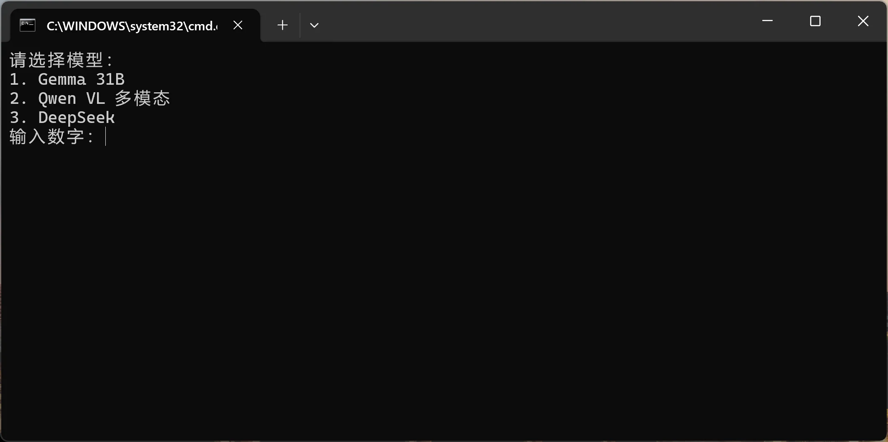
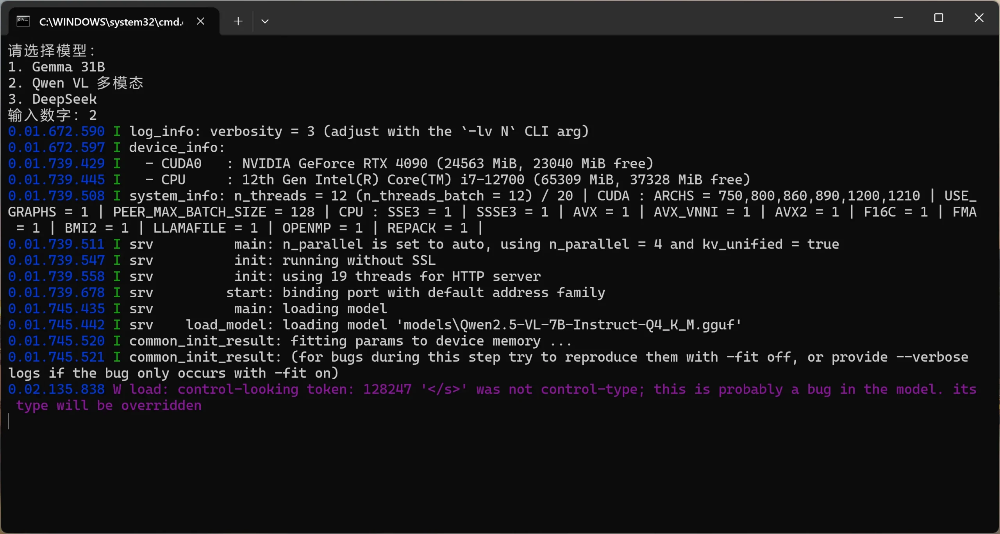
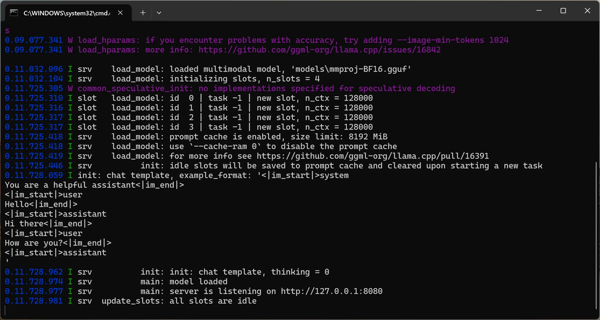

<font color=Red>**注意：如果是NVIDIA GeForce GTX 1060显卡，可能部署后默认走CPU而非使用GPU。**</font>

原因： Pascal构架导致llama.cpp默认编译成CPU模式。

解决办法：下载开源代码自行编译，（在博客中搜索<font color=Red>**1060**</font>关键字查看详细搭建过程。）

---

很多大家熟悉的本地模型，其实都可以通过 llama.cpp 运行：

- Qwen
- Llama
- DeepSeek
- Gemma
- Hermes
- Dolphin
- Mistral
- Mixtral

尤其现在 GGUF 生态越来越成熟，很多模型都会第一时间发布 GGUF 量化版本。

而 llama.cpp 最大的优势就是：

> 轻量
> 跨平台
> 支持 GPU
> 支持 CPU
> 支持 GGUF

而且现在甚至已经支持：

> 多模态
> 图片理解
> Vision 模型
> OpenAI 风格 API
> 网页聊天界面

 

# llama.cpp 最新 Windows 版本支持什么？

目前官方 Release 页面已经直接提供：

- Windows x64 CPU
- Windows x64 CUDA 12.4
- Windows x64 CUDA 13.1
- Windows x64 Vulkan
- Windows x64 HIP Radeon
- Windows x64 SYCL
- Windows ARM64 CPU

这意味着：

## NVIDIA 用户

可以直接选择：CUDA 12.4 或者 CUDA 13.1

如果你是：

- RTX 3060
- RTX 4060
- RTX 4070
- RTX 4080
- RTX 4090

基本建议优先 CUDA。

## AMD 用户

现在终于不用完全依赖 ROCm 了。

你可以：HIP 或者 Vulkan

很多情况下，Vulkan 反而比 HIP 更稳定。

## Intel 用户

现在 Intel 核显、Arc 独显也终于有得玩了。

可以尝试：SYCL 或者 Vulkan

虽然性能和 NVIDIA 还有差距，但已经能正常跑很多 GGUF 小模型。

# 如何启动 GGUF 模型？

例如：gemma-4-31b-jang-crack-Q4_K_M.gguf

启动方式其实非常简单。

进入 llama.cpp 目录：

llama-server.exe -m models\你的模型.gguf -ngl 999

 

其中：-ngl 999 代表尽量把模型全部加载到 GPU。

启动成功后，浏览器打开：http://127.0.0.1:8080

即可进入网页聊天界面。

# 如何启动 GGUF 多模态视觉模型？

加载视觉模型需要2个文件，一个是主模型文件，另外一个就是 mmproj 视觉模型加载文件

目前支持较好的包括：

## Qwen2-VL / Qwen2.5-VL

目前中文视觉能力最强之一：

- OCR
- 截图理解
- 网页识别
- 中文图片问答

表现都非常强。

### **主模型下载：【[点击前往](https://huggingface.co/unsloth/Qwen2.5-VL-7B-Instruct-GGUF/tree/main)】**

**多模态模型启用：**

llama-server.exe -m "models\主模型.gguf" --mmproj "models\mmproj视觉模型.gguf" -ngl 999

 

 

# 无审查模型：

**1、Llama3-8b-DarkIdol 是比较热门的无审查的开源大模型**

### 模型下载：【[点击前往](https://huggingface.co/aifeifei798/llama3-8B-DarkIdol-2.3-Uncensored-32K/tree/main)】

下载合并为GGUF模型格式

huggingface-cli download aifeifei798/llama3-8B-DarkIdol-2.3-Uncensored-32K --local-dir DarkIdol-HF --local-dir-use-symlinks **False**

然后用 llama.cpp 转 GGUF：

```
git clone https://github.com/ggerganov/llama.cpp
```

```
cd llama.cpp
```

```
pip install -r requirements.txt
```

```
python convert_hf_to_gguf.py ../DarkIdol-HF --outtype f16 --outfile ../DarkIdol-F16.gguf
```

需要量化成 Q4_K_M的话可以命令：

```
llama-quantize.exe ../DarkIdol-F16.gguf ../DarkIdol-Q4_K_M.gguf Q4_K_M
```

 

**2、Gemma-4-31b-jang-crack-Q4_K_M 是 Google 开源的无审查大模型**

这是一个在本地跑：听话、高效、不乱加道德判断的AI

- **推理能力扎实：在数学和代码相关任务上表现突出，尤其长上下文处理（原生支持128K，部分可扩展到256K）。你甚至可以把整个项目代码库或一本技术手册一次性喂给它，它不会轻易“失忆”。**
- **参数效率高：**
  26B MoE版本激活参数不多，跑起来相对轻快，在很多基准上效率比同级别模型更好。
- **开源友好：**
  Apache 2.0协议，允许修改、商用和二次分发，这对想自己折腾或做副业的朋友来说非常实用。

官方版的主要问题是安全对齐层比较厚，很多正常的技术探讨或创意场景容易被挡住。越狱版通过社区技术（abliteration等）移除了这部分限制，保留了绝大部分原始能力。

### 模型下载：【[点击前往](https://huggingface.co/dealignai/Gemma-4-31B-JANG_4M-CRACK/tree/main)】

# 更多越狱模型：

1、Hermes-3 【**[点击下载](https://huggingface.co/NousResearch/Hermes-3-Llama-3.1-8B)**】

2、Qwen 越狱模型【[**点击下载**](https://huggingface.co/zemelee/qwen2.5-jailbreak)】

3、Deepseek 越狱模型【**[点击下载](https://huggingface.co/huihui-ai)**】

## **多种模态自由切换运行：**

如果我们同时下载了多种不同的模型，为了方便统一管理，在运行的时候我们可以使用这个脚本，来实现多模型自由切换运行，注意将里面的模型名称改成你自己的！

```
@echo off

chcp 65001 **>**nul

cd /d C:\Users\LINGDU\Desktop\llama-b9196-bin-win-cuda-13.1-x64

echo 请选择模型：

echo 1. Gemma 31B

echo 2. Qwen VL 多模态

echo 3. DeepSeek

set /p choice=输入数字：

**if** "%choice%"=="1" llama-server.exe -m "models\gemma-4-31b-jang-crack-Q4_K_M.gguf" -ngl 999

**if** "%choice%"=="2" llama-server.exe -m "models\Qwen2.5-VL-7B-Instruct-Q4_K_M.gguf" --mmproj "models\mmproj-BF16.gguf" -ngl 999

**if** "%choice%"=="3" llama-server.exe -m "models\deepseek.gguf" -ngl 999

pause
```

将上方的命令保存到文本文档里，另存为的时候选择utf-8格式，最后将txt后缀改成bat即可！双击运行即可看到下方的选项



输入模型对应的数字就可以成功启动模型



