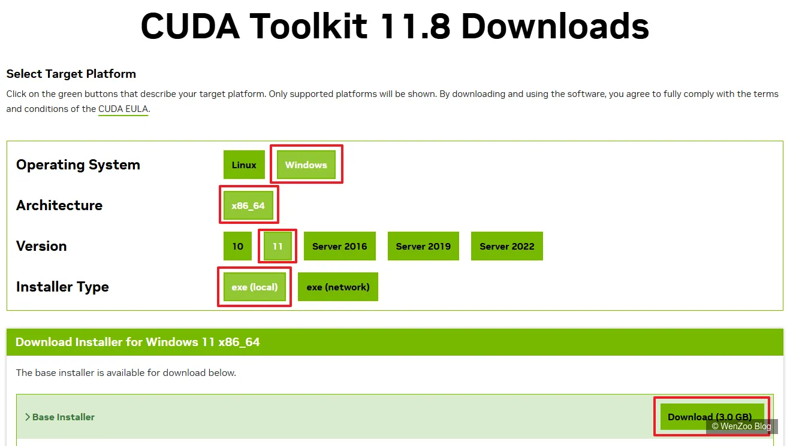
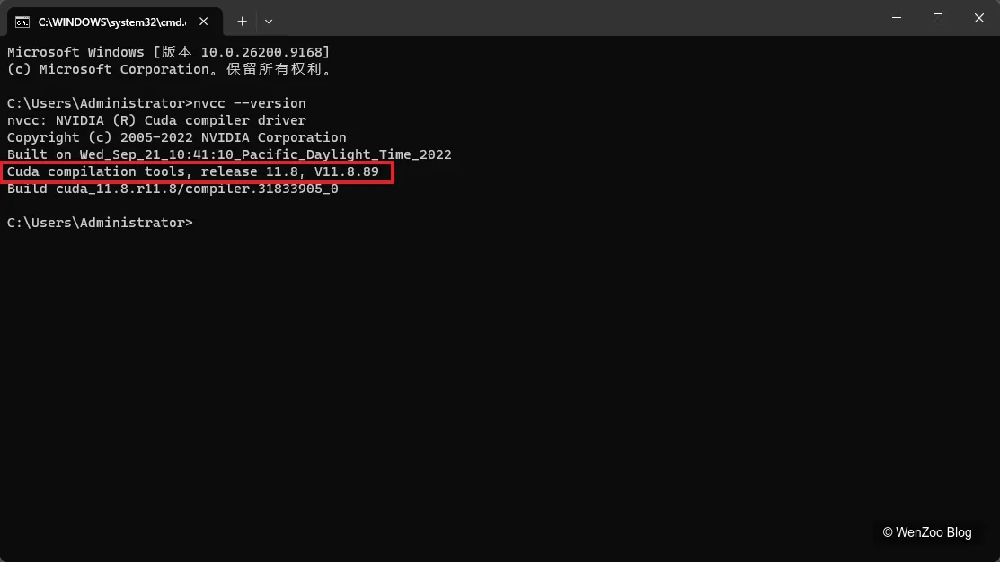
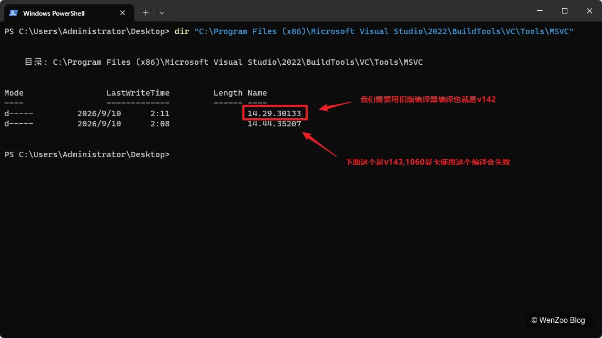
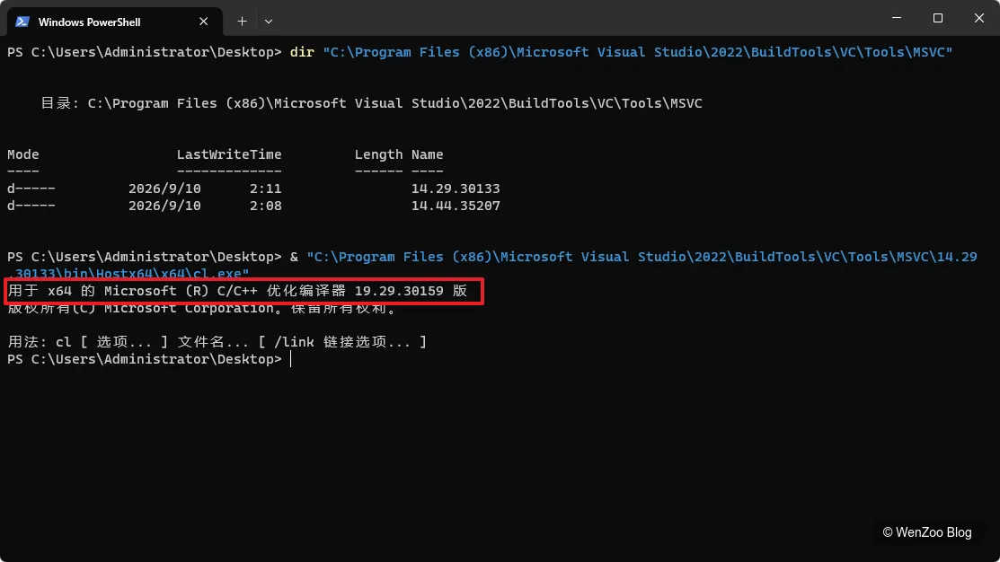
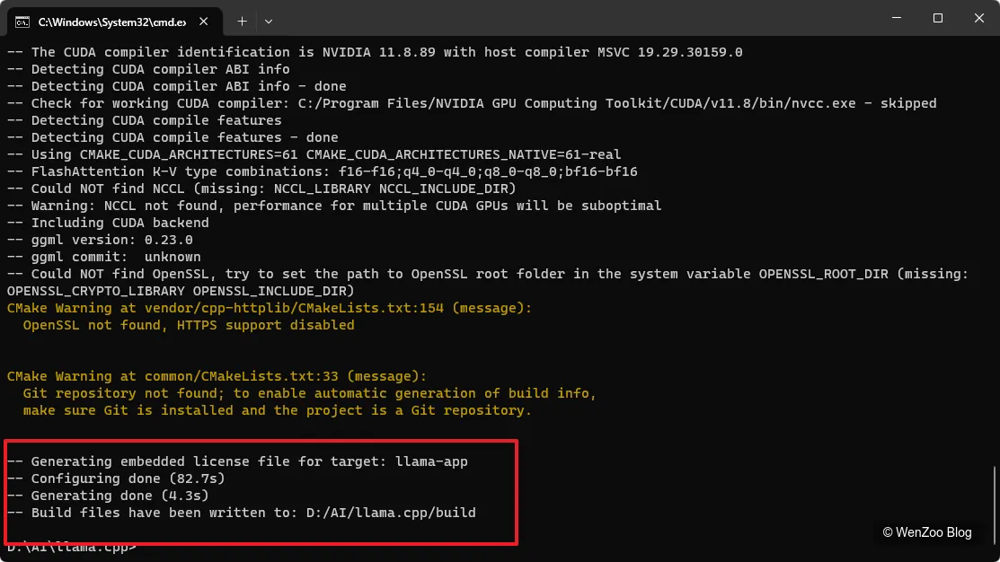
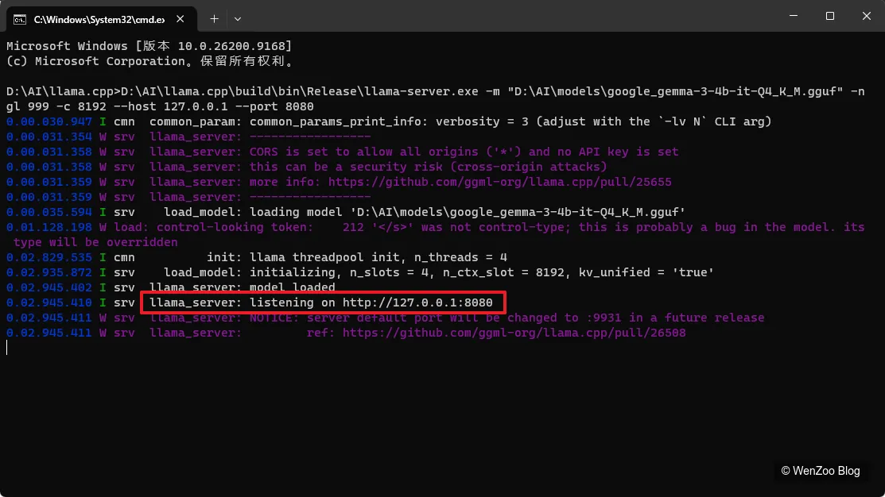

# 第一步：确认显卡驱动

先不要安装任何开发工具。

打开 PowerShell：

```
nvidia-smi
```

你应该能看到：

```
NVIDIA GeForce GTX 1060
```

以及：

```
Driver Version
CUDA Version
```

这里的 **CUDA Version 不等于 CUDA Toolkit 版本**。

例如：

```
CUDA Version: 13.0
```

并不意味着我们要安装 CUDA 13。

我们这次明确使用：

```
CUDA Toolkit 11.8
```

因为我们的目标是让 GTX 1060 的 Pascal/sm_61 编译环境稳定工作。

# 第二步：安装 Git

[下载地址：https://git-scm.com/install/windows](https://git-scm.com/install/windows)

安装 Git for Windows。

安装完成后：

```
git --version
```

例如：

```
git version 2.xx.x
```

即可。

然后以后我们把 llama.cpp 放：

```
D:\AI\
```

打开 CMD 或 PowerShell：

创建目录：

```
mkdir D:\AI
cd D:\AI
```
下载并解压缩llama.cpp源文件。

```
cd D:\AI
git clone https://github.com/ggml-org/llama.cpp.git
```

**如果网络环境不好下载进度卡住，可以直接去项目地址https://github.com/ggml-org/llama.cpp直接下载压缩包解压。（注意文件夹名）**

完成后会得到：

<font color=Red>**（注意：文件夹路径和文件夹名是否正确）**</font>

```
D:\AI\llama.cpp
```

# 第三步：安装 Visual Studio 2022 Build Tools

这一部分非常重要。

安装：

**Visual Studio 2022 Build Tools**

**官方下载页面：**

[直接下载 Visual Studio 2022 Build Tools）](https://aka.ms/vs/17/release/vs_BuildTools.exe?utm_source=chatgpt.com)

安装器里面至少选择：

### 工作负载

勾选：

```
使用 C++ 的桌面开发
```

然后右侧组件确保有：

```
MSVC v143
Windows 10/11 SDK
C++ CMake tools for Windows
```

<font color=Red>**这里有个关键点：**</font>

## 安装 MSVC v142

在：

```
单个组件
```

里面搜索：

```
v142
```

找到类似：

```
MSVC v142 - VS 2019 C++ x64/x86 build tools
```

勾选。

<font color=Red>**为了避免 CUDA 11.8 和较新的 MSVC 工具链出现兼容问题。**</font>

## 第四步：安装 CMake

[CMake下载地址：https://cmake.org/download/）](https://cmake.org/download/)

| **Platform**           | **Files**                                                    |
| :--------------------- | :----------------------------------------------------------- |
| Windows x64 Installer: | [cmake-4.4.3-windows-x86_64.msi](https://github.com/Kitware/CMake/releases/download/v4.4.3/cmake-4.4.3-windows-x86_64.msi) |

安装 CMake。

安装后：

```
cmake --version
```

确认能够执行。

建议直接使用：

```
CMake 4.x
```

即可。

# 第五步：安装 CUDA Toolkit 11.8

这一步一定要装：

[CUDA Toolkit 11.8](https://developer.nvidia.com/cuda-11-8-0-download-archive)

不是 CUDA 13。

CUDA Toolkit 11.8下载地址



安装完成后，默认路径应该类似：

```
C:\Program Files\NVIDIA GPU Computing Toolkit\CUDA\v11.8
```

然后检查：

```
where.exe nvcc
```

应该出现：

```
C:\Program Files\NVIDIA GPU Computing Toolkit\CUDA\v11.8\bin\nvcc.exe
```

然后：

```
nvcc --version
```

应该看到：

```
release 11.8
```



## 第七步：这里先停一下，做第一次检查

依次执行：

```
nvidia-smi
```

```
git --version
```

```
cmake --version
```

```
where.exe nvcc
```

```
nvcc --version
```

这五个全部正常，再继续。

## 第八步：确认 MSVC v142

PowerShell 执行：

```
dir "C:\Program Files (x86)\Microsoft Visual Studio\2022\BuildTools\VC\Tools\MSVC"
```



再执行：

```
& "C:\Program Files (x86)\Microsoft Visual Studio\2022\BuildTools\VC\Tools\MSVC\14.29.30133\bin\Hostx64\x64\cl.exe"
```



正常应该看到：

```
Microsoft (R) C/C++ 优化编译器 19.29.30133 版
```

# 第九步：不要直接用普通 PowerShell 编译

<font color=Red>**这是容易踩坑的重要地方。**</font>

这次建议直接使用：（按WIN键 + S输入x64 Native Tools Command Prompt for VS 2022以管理员身份运行）

```
x64 Native Tools Command Prompt for VS 2022
```

然后在这个窗口里面进行 CMake 配置和编译。

把 CUDA 11.8 的 4 个集成文件复制到 VS2022 对应目录。

在当前 CMD 执行：

复制这 4 个文件：

```
copy "C:\Program Files\NVIDIA GPU Computing Toolkit\CUDA\v11.8\extras\visual_studio_integration\MSBuildExtensions\CUDA 11.8.props" "C:\Program Files (x86)\Microsoft Visual Studio\2022\BuildTools\MSBuild\Microsoft\VC\v160\BuildCustomizations\"
```

```
copy "C:\Program Files\NVIDIA GPU Computing Toolkit\CUDA\v11.8\extras\visual_studio_integration\MSBuildExtensions\CUDA 11.8.targets" "C:\Program Files (x86)\Microsoft Visual Studio\2022\BuildTools\MSBuild\Microsoft\VC\v160\BuildCustomizations\"
```

```
copy "C:\Program Files\NVIDIA GPU Computing Toolkit\CUDA\v11.8\extras\visual_studio_integration\MSBuildExtensions\CUDA 11.8.xml" "C:\Program Files (x86)\Microsoft Visual Studio\2022\BuildTools\MSBuild\Microsoft\VC\v160\BuildCustomizations\"
```

```
copy "C:\Program Files\NVIDIA GPU Computing Toolkit\CUDA\v11.8\extras\visual_studio_integration\MSBuildExtensions\Nvda.Build.CudaTasks.v11.8.dll" "C:\Program Files (x86)\Microsoft Visual Studio\2022\BuildTools\MSBuild\Microsoft\VC\v160\BuildCustomizations\"
```

## 正式编译

在 CMD 执行：

```
cd /d D:\AI\llama.cpp
```

然后执行 CMake 配置

```
cmake -B build -G "Visual Studio 17 2022" -A x64 -T "v142,cuda=11.8" -DGGML_CUDA=ON -DCMAKE_CUDA_ARCHITECTURES=61
```

这里**暂时不要改任何参数**。

尤其是：

```
-T "v142,cuda=11.8"
```

它会告诉 CMake：

> 使用 Visual Studio 2022 的 **v142 工具集**，CUDA 使用 **11.8**。

而：

```
-DGGML_CUDA=ON
```

启用 CUDA。

```
-DCMAKE_CUDA_ARCHITECTURES=61
```

针对你的 **GTX 1060 / Pascal / SM 6.1**。



说明CMake 配置已经完全成功。

**现在开始真正编译**。

执行这一条：

```
cd /d D:\AI\llama.cpp

cmake -B build -G "Visual Studio 17 2022" -A x64 -T "v142,cuda=11.8" -DGGML_CUDA=ON -DCMAKE_CUDA_ARCHITECTURES=61 -DLLAMA_BUILD_UI=ON -DLLAMA_USE_PREBUILT_UI=OFF
```

执行：

```
cmake --build build --config Release --target llama-server -j 4
```

**先让它完整跑完。**

**这一阶段可能需要一些时间。**

llama.cpp启动：

```
D:\AI\llama.cpp\build\bin\Release\llama-server.exe -m "D:\AI\models\google_gemma-3-4b-it-Q4_K_M.gguf" -ngl 999 -c 8192 --host 127.0.0.1 --port 8080
```



在浏览器输入：http://127.0.0.1:8080 回车，出现聊天对话框可以正常使用，本地部署成功。

可以创建一个D:\AI\llama.cpp\启动llama.bat

````
```bat
@echo off
chcp 65001 >nul
title llama.cpp - Gemma 3 4B

echo.
echo ========================================
echo llama.cpp - Gemma 3 4B
echo ========================================
echo.
echo 正在启动模型，请稍候...
echo.

start "llama.cpp - Gemma 3 4B" cmd /k ""D:\AI\llama.cpp\build\bin\Release\llama-server.exe" -m "D:\AI\models\google_gemma-3-4b-it-Q4_K_M.gguf" -ngl 999 -c 8192 --host 127.0.0.1 --port 8080"

echo 等待模型启动...
timeout /t 15 /nobreak >nul

start "" "http://127.0.0.1:8080"

exit
```

````

这样双击就可以直接运行本地部署的llama.cpp。

---

以上文章中提到的所有软件如果网络环境不好，可以通过网盘下载。

百度网盘：

链接: 

```
https://pan.baidu.com/s/1oBh0GcR6GomIGq66ETcJfQ?pwd=86rx
```

提取码: 

```
86rx
```

