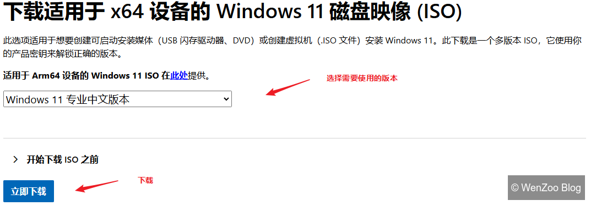
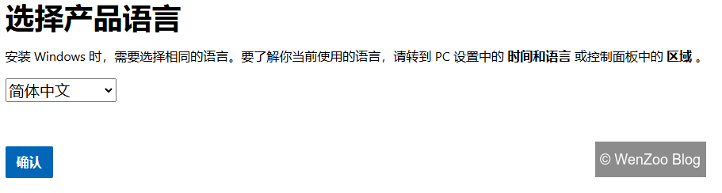
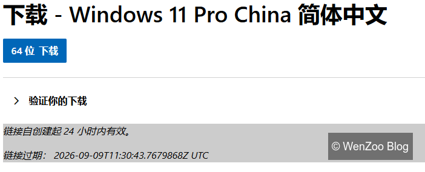
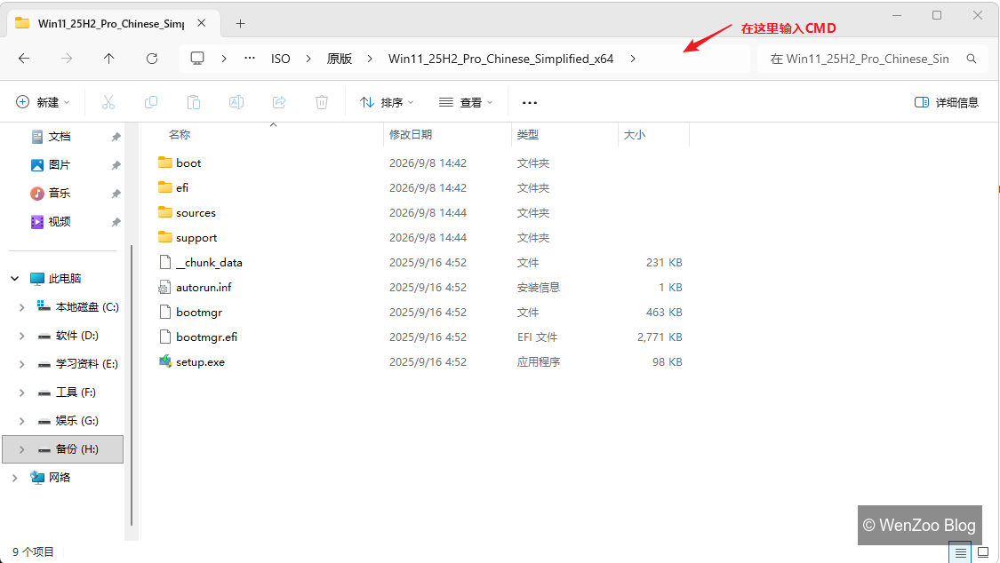
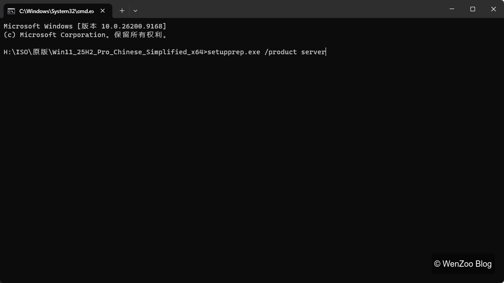

## 1、下载Windows11系统镜像

下载地址：https://www.microsoft.com/zh-hk/software-download/windows11



点击下载后会弹出下面这个选项。



选择语言，确定。



## 2、解压ISO镜像文件

将下载的Win11_25H2_Pro_Chinese_Simplified_x64.iso文件解压缩到文件夹。（注：不是加载或直接双击打开）



将这段命令输入并回车。

```
setupprep.exe /product server
```

