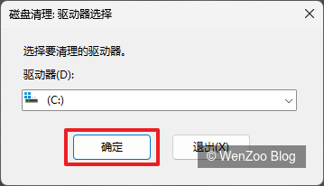
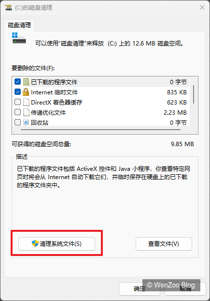
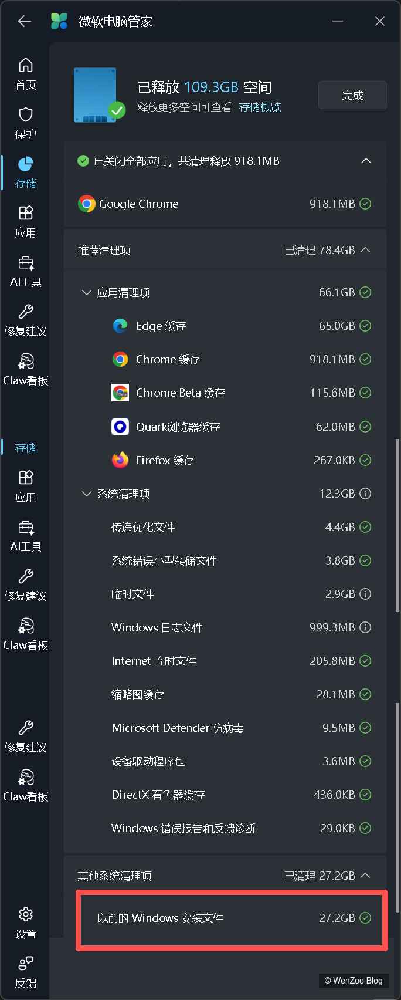
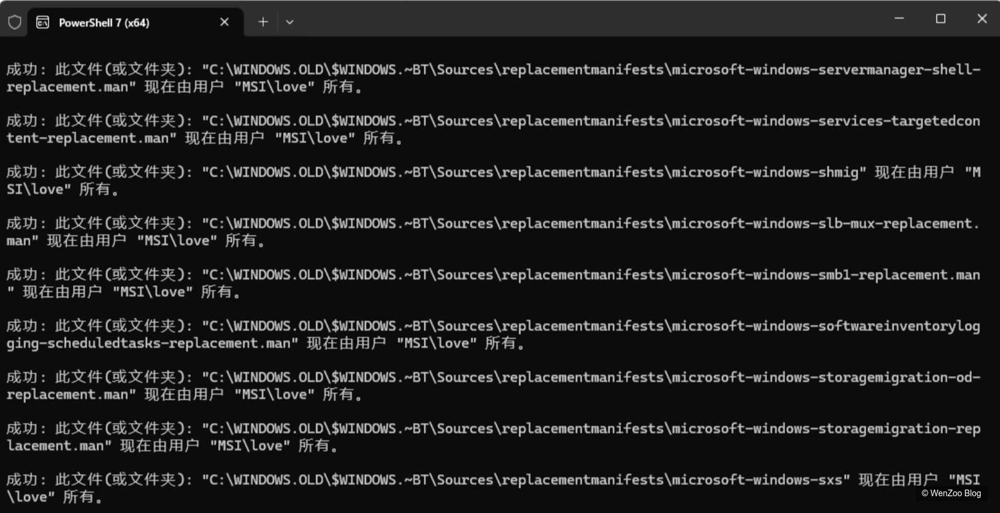

## 方法一：使用磁盘清理工具（推荐）

1. 按 **Win + R**，输入 

   ```
   cleanmgr
   ```

    并回车，打开磁盘清理程序。

   

2. 选择 **C 盘**（Windows.old 所在盘），确定。

   

3. 点击 **清理系统文件**，再次选择 C 盘。

   

4. 在列表中勾选 **以前的 Windows 安装文件**，也可选择其他临时文件。

   

5. 点击 **确定** 并确认删除，系统会自动清理 Windows.old 文件夹。


## 方法二：微软电脑管家




## 方法三：使用命令行方式

#### 1.以管理员身份打开命令提示符

按 Win +S，输入 cmd，右键单击「命令提示符」，选择 以管理员身份运行。

#### 2.夺取文件夹所有权

执行以下命令（按 Enter）：

```
takeown /f C:\Windows.old /r /d y
```

- **takeown**：Windows 内置的"获取所有权"命令

- **/f**：指定目标文件夹

- **/r**：递归处理所有子文件夹和文件

- **/d y**：对所有权限确认提示自动回答"是"

<font color="red">**注意：由于文件夹较大，此命令可能需要运行几分钟，请耐心等待。**</font>

#### 3.授予完全控制权限

```
icacls C:\Windows.old /grant administrators:F /t
```

- **icacls**：修改文件和文件夹的访问控制列表
- **/grant administrators:F**：将完全控制权授予 Administrators 组
- **/t**：递归应用于所有子文件夹和文件

#### 4.删除文件夹

执行完后，直接在资源管理器中右键删除 `C:\Windows.old`，或在命令行中继续执行：

```
rmdir /s /q C:\Windows.old
```



---

## 注意事项

| 注意                   | 说明                                                         |
| ---------------------- | ------------------------------------------------------------ |
| 数据不可恢复           | 删除 Windows.old 是永久性的，其中的个人文件（如旧系统的文档、桌面文件）将无法恢复。删除前请确认已备份所需文件 |
| 无法回滚系统           | 删除 Windows.old 后，你将无法通过「设置 → 恢复 → 回退到以前的版本」将系统降级到更新前的版本 |
| 只需在更新后等待 10 天 | Windows 会在首次更新 10 天后自动清理 Windows.old，如果你不急，让系统自行处理是最安全的选择 |
| 注意命令执行           | 方法三中提到的命令（尤其是 <font color="red">**takeown**</font> 和 <font color="red">**rmdir**</font>），操作过程中可能会有较长的等待时间，请勿在此期间关闭命令提示符窗口 |


​	
